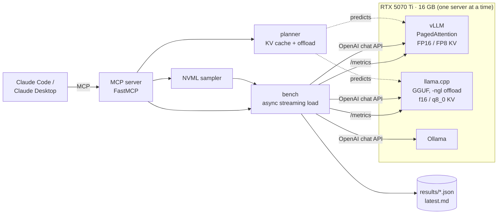
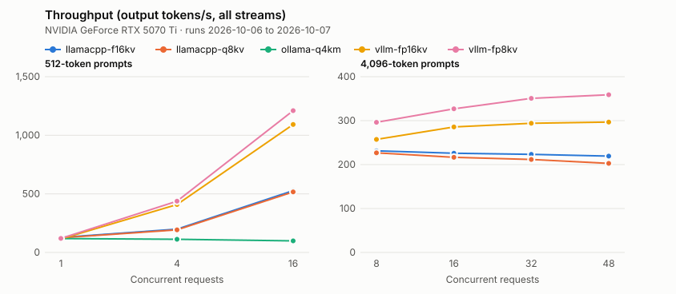
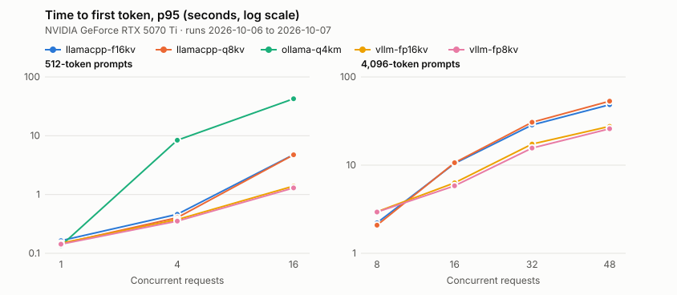

# Local Inference Lab

Serve, size and benchmark open LLMs on one consumer GPU (built on an RTX 5070 Ti, 16 GB, CUDA 12.8).

- **Three servers, one harness.** vLLM, llama.cpp and Ollama run from one `docker-compose.yml`; a streaming
  load generator measures each one on the same prompts at rising concurrency.
- **VRAM planning before launch.** A planner predicts how much KV cache vLLM will allocate, how many full-length
  sequences fit, and how many blocks of a too-big GGUF model llama.cpp can keep on the GPU (`-ngl`), reading
  exact tensor sizes from the GGUF file.
- **GPU and server telemetry.** NVML sampling (peak VRAM, utilization, power) plus each server's Prometheus
  metrics (KV cache fill, preemptions, the cache vLLM actually allocated) recorded with every run.
- **An MCP server for agents.** The same tools, exposed over the Model Context Protocol (FastMCP), so Claude Code
  or Claude Desktop can check the GPU, size a deployment and run a benchmark by asking.

**Demo:** [howardguoui.github.io/local-inference-lab](https://howardguoui.github.io/local-inference-lab/): the
published results as charts, and the vLLM planner running in your browser (free static page, rebuilt from
`results/` by `inference-lab demo`).

**Stack:** Python, asyncio + httpx, vLLM, llama.cpp, Ollama, NVML, Prometheus, FastMCP, Docker Compose, pytest,
GitHub Actions



## What it measures

| Metric | Why it matters |
| --- | --- |
| Requests in flight (measured) | Confirms each level really ran at its concurrency |
| Throughput (output tok/s, all streams) | What batching buys: decode is memory-bound, so serving 16 streams costs little more than 1 |
| TTFT p50 / p95 | Queueing plus prefill: what a user waits before the first word |
| TPOT p50 | Decode speed per stream once it has started |
| Peak VRAM, GPU utilization, power | From NVML, sampled every 250 ms during each level |
| Peak KV cache fill, preemptions | From vLLM's `/metrics`: a full cache makes vLLM evict and recompute sequences. Current llama.cpp and Ollama don't publish a KV fill metric |
| KV blocks vLLM allocated | Read from `vllm:cache_config_info` and compared with the planner's prediction |

Every prompt starts with a unique request number, so prefix caching can't make repeated prompts look free.
Generation ignores end-of-sequence (`ignore_eos`), so every request on vLLM and llama.cpp produces exactly
`--max-tokens` tokens. Ollama's OpenAI endpoint drops that flag, so its requests can stop early; the report shows
the measured prompt and output token counts on every row, so the difference is visible.
Mid-stream errors (servers send them inside a 200 response) and empty completions count as failures.

## Results

Measured on one NVIDIA GeForce RTX 5070 Ti (15.92 GiB): the vLLM and llama.cpp matrix on 2026-10-07, Ollama's chat
scenario on 2026-10-06. One run per config, no errors in any of them. Numbers are copied from
[`results/latest.md`](results/latest.md), which also has TTFT, TPOT, VRAM and KV cache for every row.

Throughput in output tokens/s across all streams, by concurrency:

| Server config | chat, 1 | chat, 4 | chat, 16 | long, 8 | long, 16 | long, 32 | long, 48 |
| --- | ---: | ---: | ---: | ---: | ---: | ---: | ---: |
| vllm-fp16kv | 114.9 | 408.8 | 1092.4 | 257.2 | 285.6 | 294 | 296.8 |
| vllm-fp8kv | 120 | 437.8 | 1209.9 | 296.2 | 326.9 | 350.7 | 359 |
| llamacpp-f16kv | 128 | 198.9 | 527.4 | 231.2 | 225.8 | 223.2 | 219.2 |
| llamacpp-q8kv | 124.5 | 192.9 | 516.9 | 226.8 | 216.6 | 211.7 | 202.8 |
| ollama-q4km | 118.4 | 112.8 | 99.1 | – | – | – | – |




- **One stream is a tie, batching is not.** At concurrency 1 every config lands between 114.9 and 128 tok/s. At 16
  chat streams vLLM reaches 1092.4 (FP16 KV) and 1209.9 tok/s (FP8 KV), llama.cpp 527.4 and 516.9, and Ollama 99.1
  with a TTFT p95 of 42.5 s.
- **FP8 KV cache pays off when the cache is the limit.** vLLM allocated 9,878 KV blocks (158,048 tokens) with FP16
  and 17,019 blocks (272,304 tokens) with FP8. With 48 long requests in flight the FP16 cache peaked at 100% and
  vLLM preempted 6 sequences; the FP8 cache peaked at 65% with no preemptions, at 359 against 296.8 tok/s.
- **llama.cpp's q8_0 KV cache trades a little speed for memory.** Peak VRAM was 7.68 to 8.03 GiB against 9.28 to
  9.5 GiB with f16, and throughput was lower at every level (202.8 against 219.2 tok/s at 48 long streams).
- **Past its 8 slots llama.cpp queues.** Its long-scenario throughput stays between 219.2 and 231.2 tok/s (f16) from
  8 to 48 streams while TTFT p95 grows from 2.2 s to 48.4 s; vLLM FP16 is at 27.5 s at 48.

Not measured yet: Ollama on the long scenario and the optional 32B partial-offload run. To reproduce or extend, run
`scripts/run_matrix.sh` on the GPU machine; it benchmarks each config in turn and writes a JSON file per run, then
`inference-lab report` rebuilds `results/latest.md` and the two charts from those files.

| Server configs | Scenarios |
| --- | --- |
| vLLM, FP16 and FP8 KV cache (Qwen2.5-7B AWQ) | **chat:** 512-token prompts, 256 output tokens, concurrency 1 / 4 / 16 |
| llama.cpp, f16 and q8_0 KV cache (Qwen2.5-7B Q4_K_M) | **long:** 4,096-token prompts, 256 output tokens, concurrency 8 / 16 / 32 / 48 with 144 requests per level: 48 in flight need ~210k tokens of KV cache, more than vLLM's FP16 cache holds, which is where FP8 should pay off |
| Ollama (qwen2.5:7b-instruct, Q4_K_M) | |
| Optional: Qwen2.5-32B Q4_K_M through llama.cpp with the planner's `-ngl` | chat, concurrency 1 / 2 |

The engines are not configured identically, and the table should be read with that in mind: vLLM batches up to
64 sequences, while llama.cpp and Ollama run 8 parallel slots, so above concurrency 8 their extra requests queue
and show up as TTFT. vLLM serves AWQ 4-bit weights, the others GGUF Q4_K_M.

## Demo page

`inference-lab demo` writes `docs/` (served by GitHub Pages from `main`): throughput and time-to-first-token
charts for every saved run, the FP16 vs FP8 KV cache comparison, and the vLLM planner ported to `planner.js`.
`data.json` carries the runs from `results/`, the planner's constants and model presets, and a predicted-vs-actual
check: for the Qwen2.5-7B AWQ checkpoint (5.19 GiB of weights) on the 15.92 GiB card the planner predicted
143,040 FP16 and 286,096 FP8 KV tokens against the 158,048 and 272,304 vLLM allocated (−9.5% and +5.1%).
`tests/test_demo.py` runs `planner.js` under Node and checks it against `plan_vllm` on 1,008 input combinations.

## The planner

KV cache per token = 2 (K and V) × layers × KV heads × head dim × bytes per value. Both models below use
grouped-query attention; Qwen2.5-7B needs 44% of Llama 3.1 8B's cache per token because it has 4 KV heads instead
of 8 and 28 layers instead of 32 (0.5 × 0.875):

```
$ inference-lab plan kv --model qwen2.5-7b --tokens 32768
qwen2.5-7b: 28 layers, 4 KV heads x 128 dims (GQA 7:1), one 32,768-token sequence:

  engine     dtype     KiB/token      GiB
  vllm       float16        56.0     1.75
  vllm       fp8            28.0    0.875
  llama.cpp  f32           112.0      3.5
  llama.cpp  f16            56.0     1.75
  llama.cpp  q8_0           29.8     0.93
  llama.cpp  q5_1           21.0    0.656
  llama.cpp  q5_0           19.2    0.602
  llama.cpp  q4_1           17.5    0.547
  llama.cpp  q4_0           15.8    0.492      (iq4_nl is the same size)

$ inference-lab plan kv --model llama-3.1-8b --tokens 32768
  vllm       float16       128.0      4.0
```

**vLLM:** it claims `--gpu-memory-utilization` × VRAM, loads the weights, reserves activation and CUDA-graph
memory, and splits the rest into 16-token KV blocks. The plan predicts the block count; the benchmark records the
real one so the two can be compared.

```
$ inference-lab plan vllm --model qwen2.5-7b --weights-gib 5.2 --max-model-len 32768 --gpu-gib 16
  kv_budget_gib              7.7
  kv_tokens                  144,176
  kv_blocks                  9,011
  max_concurrent_at_max_len  4
  --kv-cache-dtype fp8 would hold about 288,352 tokens (8 full-length sequences).
```

**llama.cpp and models bigger than VRAM:** with `-ngl N`, llama.cpp puts the output head on the GPU first, then
the **last** N-1 transformer blocks with their KV cache; the first blocks and the token embeddings stay in system
RAM ([`llama-model.cpp`](https://github.com/ggml-org/llama.cpp/blob/master/src/llama-model.cpp), where
`i_gpu_start = n_layer + 1 - ngl`). The planner reads each tensor's size from the GGUF file
(`--gguf-path`) and finds the largest N that fits; with only a file size it estimates the split from the model's
vocabulary and hidden size. Recent llama.cpp can choose N itself (`--fit`); the planner shows the arithmetic.

```
$ inference-lab plan llamacpp --model qwen2.5-32b --gguf-gib 18.5 --ctx 8192 --gpu-gib 15.5
  ngl                46
  blocks_on_gpu      45
  total_blocks       64
  vram_estimate_gib  15.28
  cpu_weights_gib    5.63
  -ngl 46: the output head and the last 45 of 64 blocks on the GPU, 5.6 GiB of weights in system RAM.
  Generation speed is then bound by RAM bandwidth. A quantized KV cache (-ctk q8_0 -ctv q8_0, with -fa on)
  frees room for more blocks.
```

The overhead terms (activations, CUDA graphs, llama.cpp's compute buffer) are estimates with conservative
defaults, exposed as flags. Without `--gpu-gib`, plans use NVML: total VRAM for vLLM (it sizes from total memory),
free VRAM for llama.cpp (it must fit beside whatever else is running, such as a Windows desktop).

## Run it

```bash
pip install -e ".[dev]"
inference-lab gpu                                    # NVML snapshot

scripts/get_models.sh                                # GGUF for llama.cpp (vLLM and Ollama fetch their own)
docker compose --profile vllm up -d                  # one server at a time
inference-lab bench --backend vllm --concurrency 1 4 16 --label vllm-fp16kv
docker compose --profile vllm down

scripts/run_matrix.sh                                # every config, then results/latest.md
ONLY="vllm llamacpp" scripts/run_matrix.sh           # a subset (e.g. Ollama already runs on the host)
scripts/publish_results.sh                           # run the matrix and push results to GitHub
```

Windows: run the scripts from WSL 2 with Docker Desktop's GPU support enabled, and set **CUDA - Sysmem Fallback
Policy** to *Prefer No Sysmem Fallback* in the NVIDIA Control Panel while benchmarking. Otherwise the driver spills
VRAM overflow into system RAM instead of failing, and an over-sized config runs slowly but looks valid.

## Use it from Claude (MCP)

```bash
claude mcp add inference-lab -e INFERENCE_LAB_HOME=/path/to/local-inference-lab -- inference-lab mcp
```

Claude Desktop (`claude_desktop_config.json`):

```json
{
  "mcpServers": {
    "inference-lab": {
      "command": "inference-lab",
      "args": ["mcp"],
      "env": { "INFERENCE_LAB_HOME": "/path/to/local-inference-lab" }
    }
  }
}
```

`INFERENCE_LAB_HOME` tells the server where `configs/backends.yaml` and `results/` live, since MCP clients start it
from their own working directory. An editable install (`pip install -e .`) finds the repo without it.

| Tool | Does |
| --- | --- |
| `gpu_status` | VRAM used and free, utilization, temperature, power |
| `kv_cache_size`, `list_models` | KV cache per storage type for a model and context length |
| `plan_vllm_deployment` | KV tokens and blocks vLLM will allocate; whether `max_model_len` fits |
| `plan_llamacpp_offload` | Largest `-ngl` for a GGUF file (exact tensor sizes) and its VRAM estimate |
| `list_backends`, `backend_metrics` | Which servers are up; live KV cache fill, queue depth, preemptions |
| `run_benchmark` | Benchmarks a server and saves the run; results also readable as `lab://results/latest` |

## Tests

```bash
pytest
```

The planner math (checked against published per-token KV sizes and llama.cpp's layer placement), GGUF reading on
real files written with the `gguf` library, the Prometheus parser on current vLLM and llama.cpp output, the load
generator against a fake streaming OpenAI-compatible server (TTFT, fixed-length output, mid-stream errors, KV cache
fill and preemptions under overload), the NVML sampler with a fake driver, and the MCP server both in memory and
as a stdio subprocess. CI runs them on pushes to `main` and on pull requests.

## Layout

```
src/inference_lab/  models.py · gguf_layout.py · planner.py · gpu.py (NVML) · prom.py (/metrics) · bench.py
                    report.py · backends.py · paths.py · mcp_server.py (FastMCP) · cli.py
configs/            backends.yaml
scripts/            get_models.sh · run_matrix.sh
docker-compose.yml  vllm · llamacpp · ollama profiles
```
