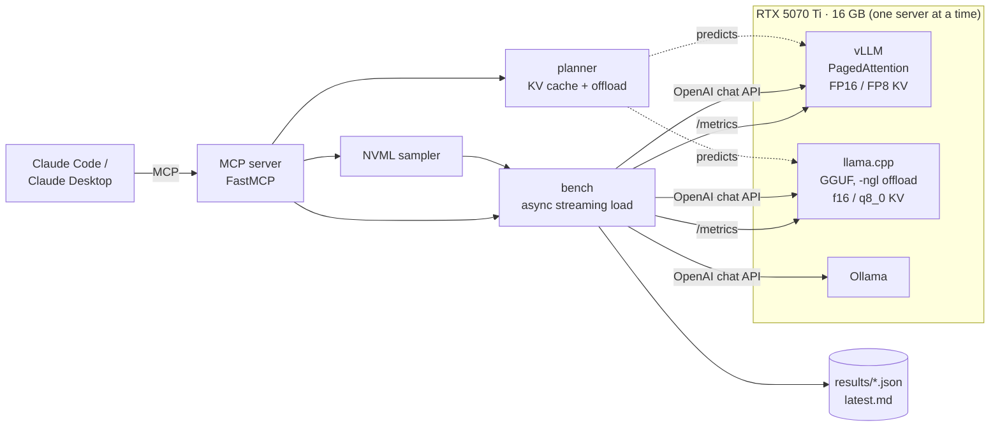

# Local Inference Lab

Serve, size and benchmark open LLMs on one consumer GPU (built on an RTX 5070 Ti, 16 GB, CUDA 12.8).

- **Three servers, one harness.** vLLM, llama.cpp and Ollama run from one `docker-compose.yml`; a streaming
  load generator measures each one on the same prompts at rising concurrency.
- **VRAM planning before launch.** A planner predicts how much KV cache vLLM will allocate, how many full-length
  sequences fit, and how many layers of a too-big GGUF model llama.cpp can keep on the GPU (`-ngl`).
- **GPU and server telemetry.** NVML sampling (peak VRAM, utilization, power) plus each server's Prometheus
  metrics (KV cache fill, preemptions, the cache vLLM actually allocated) recorded with every run.
- **An MCP server for agents.** The same tools, exposed over the Model Context Protocol (FastMCP), so Claude Code
  or Claude Desktop can check the GPU, size a deployment and run a benchmark by asking.

**Stack:** Python, asyncio + httpx, vLLM, llama.cpp, Ollama, NVML, Prometheus, FastMCP, Docker Compose, pytest,
GitHub Actions



## What it measures

| Metric | Why it matters |
| --- | --- |
| Throughput (output tok/s, all streams) | What batching buys: decode is memory-bound, so serving 16 streams costs little more than 1 |
| TTFT p50 / p95 | Queueing plus prefill: what a user waits before the first word |
| TPOT p50 | Decode speed per stream once it has started |
| Peak VRAM, GPU utilization, power | From NVML, sampled every 250 ms during each level |
| Peak KV cache fill, preemptions | From the server's `/metrics`: a full cache makes vLLM evict and recompute sequences |
| KV blocks vLLM allocated | Read from `vllm:cache_config_info` and compared with the planner's prediction |

Every prompt starts with a unique request number, so prefix caching can't make repeated prompts look free.

## Results

Run `scripts/run_matrix.sh` on the GPU machine; it benchmarks each config in turn and writes
`results/latest.md` (one row per server config and concurrency level) plus a JSON file per run.
Configs: vLLM with FP16 and FP8 KV cache, llama.cpp with f16 and q8_0 KV cache, Ollama, and optionally
Qwen2.5-32B through llama.cpp with partial GPU offload.

## The planner

KV cache per token = 2 (K and V) × layers × KV heads × head dim × bytes per value. Grouped-query attention is why
Qwen2.5-7B (4 KV heads for 28 query heads) needs less than half the cache of Llama 3.1 8B:

```
$ inference-lab plan kv --model qwen2.5-7b --tokens 32768
qwen2.5-7b: 28 layers, 4 KV heads x 128 dims (GQA 7:1), one 32,768-token sequence:

  engine     dtype     KiB/token      GiB
  vllm       float16        56.0     1.75
  vllm       fp8            28.0    0.875
  llama.cpp  f16            56.0     1.75
  llama.cpp  q8_0           29.8     0.93
  llama.cpp  q4_0           15.8    0.492
```

**vLLM:** it claims `--gpu-memory-utilization` × VRAM, loads the weights, reserves activation and CUDA-graph
memory, and splits the rest into 16-token KV blocks. The plan predicts the block count; the benchmark records the
real one so the two can be compared.

```
$ inference-lab plan vllm --model qwen2.5-7b --weights-gib 5.2 --max-model-len 32768
  kv_budget_gib              7.7
  kv_tokens                  144,176
  kv_blocks                  9,011
  max_concurrent_at_max_len  4
  --kv-cache-dtype fp8 would hold about 288,352 tokens (8 full-length sequences).
```

**llama.cpp and models bigger than VRAM:** `-ngl N` keeps the first N layers (weights and their KV cache) on the
GPU and runs the rest on the CPU. The planner finds the largest N that fits:

```
$ inference-lab plan llamacpp --model qwen2.5-32b --gguf-gib 18.5 --ctx 8192
  gpu_layers             47
  total_layers           65
  vram_estimate_gib      15.85
  Offload 47 of 65 layers (-ngl 47); the rest run on the CPU, so generation speed is bound by
  system RAM bandwidth. A quantized KV cache (-ctk q8_0 -ctv q8_0, needs -fa on) frees room for more GPU layers.
```

The overhead terms (activations, CUDA graphs, llama.cpp's compute buffer, a desktop's display) are estimates
with conservative defaults, exposed as flags. Checkpoint sizes come from the files themselves
(`--weights-path`, `--gguf-path`).

## Run it

```bash
pip install -e ".[dev]"
inference-lab gpu                                    # NVML snapshot

scripts/get_models.sh                                # GGUF for llama.cpp (vLLM and Ollama fetch their own)
docker compose --profile vllm up -d                  # one server at a time
inference-lab bench --backend vllm --concurrency 1 4 16 --label vllm-fp16kv
docker compose --profile vllm down

scripts/run_matrix.sh                                # every config, then results/latest.md
```

Windows: run the scripts from WSL 2 with Docker Desktop's GPU support enabled.

## Use it from Claude (MCP)

```bash
claude mcp add inference-lab -- inference-lab mcp     # Claude Code
```

Claude Desktop (`claude_desktop_config.json`):

```json
{ "mcpServers": { "inference-lab": { "command": "inference-lab", "args": ["mcp"] } } }
```

| Tool | Does |
| --- | --- |
| `gpu_status` | VRAM used and free, utilization, temperature, power |
| `kv_cache_size`, `list_models` | KV cache per storage type for a model and context length |
| `plan_vllm_deployment` | KV tokens and blocks vLLM will allocate; whether `max_model_len` fits |
| `plan_llamacpp_offload` | Largest `-ngl` for a GGUF model and its VRAM estimate |
| `list_backends`, `backend_metrics` | Which servers are up; live KV cache fill, queue depth, preemptions |
| `run_benchmark` | Benchmarks a server and saves the run; results also readable as `lab://results/latest` |

## Tests

```bash
pytest
```

The planner math (checked against published per-token KV sizes), the Prometheus parser on vLLM and llama.cpp
output, the load generator against a fake streaming OpenAI-compatible server (TTFT, tokens, KV cache fill,
preemptions under overload), the NVML sampler with a fake driver, and the MCP server both in memory and as a stdio
subprocess. CI runs them on every push and pull request.

## Layout

```
src/inference_lab/  models.py · planner.py · gpu.py (NVML) · prom.py (/metrics) · bench.py · report.py
                    backends.py · mcp_server.py (FastMCP) · cli.py
configs/            backends.yaml
scripts/            get_models.sh · run_matrix.sh
docker-compose.yml  vllm · llamacpp · ollama profiles
```
